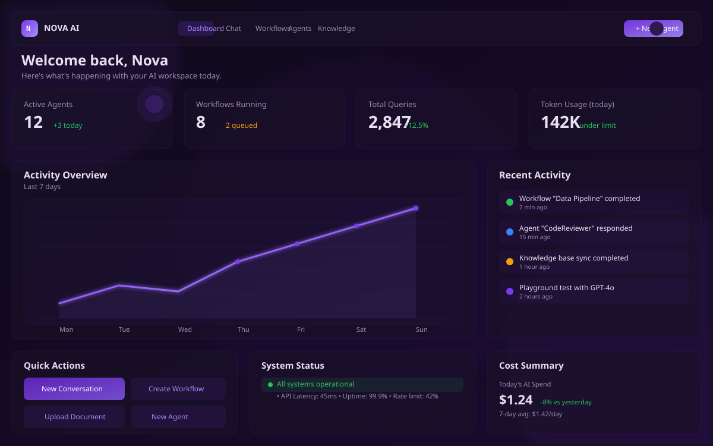
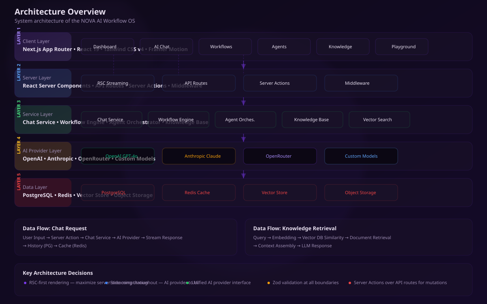
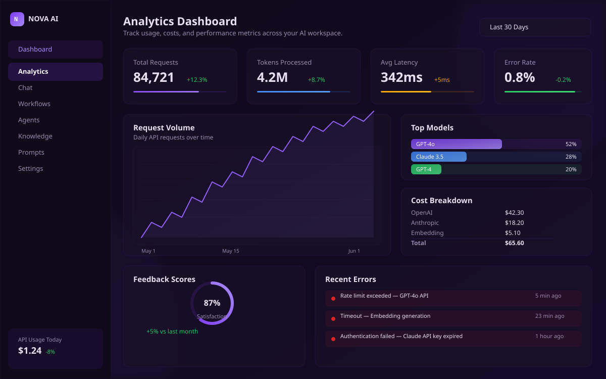
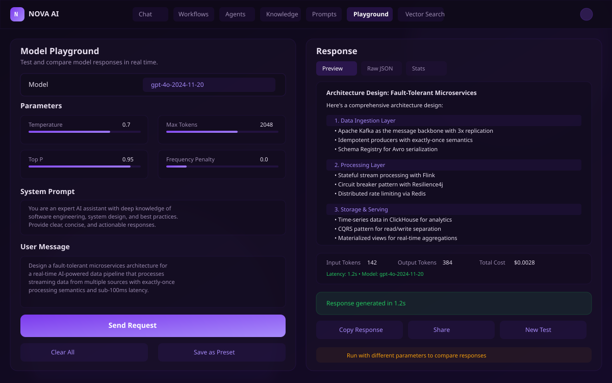
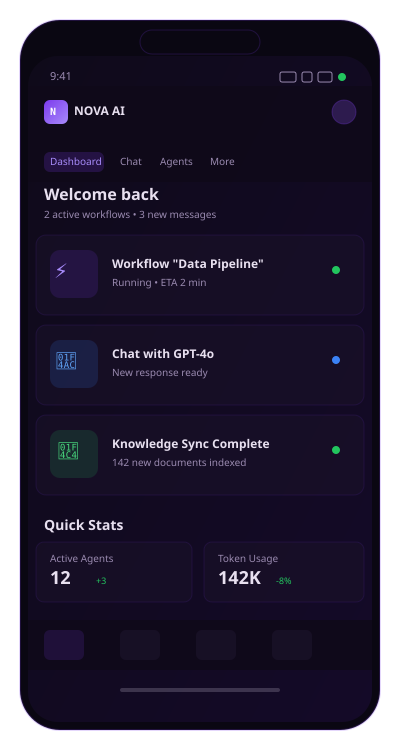
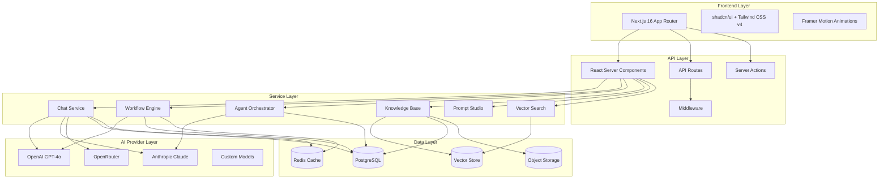

<div align="center">

```
  ███╗   ██╗ ██████╗ ██╗   ██╗ █████╗
  ████╗  ██║██╔═══██╗██║   ██║██╔══██╗
  ██╔██╗ ██║██║   ██║██║   ██║███████║
  ██║╚██╗██║██║   ██║╚██╗ ██╔╝██╔══██║
  ██║ ╚████║╚██████╔╝ ╚████╔╝ ██║  ██║
  ╚═╝  ╚═══╝ ╚═════╝   ╚═══╝  ╚═╝  ╚═╝
```

# NOVA — AI Workflow OS

**AI-native workflow operating system** — intelligent agent orchestration, knowledge base management, prompt engineering studio, vector search, and multi-model playground.

**OpenAI + Notion + Vercel AI + Dify inspired.**

<p>
  
  
  
  
  
  
  <br/>
  
  
  
</p>

---

[Overview](#overview) • [Features](#features) • [Tech Stack](#tech-stack) • [Screenshots](#screenshots) • [Architecture](#architecture) • [Getting Started](#getting-started) • [Environment](#environment) • [Deployment](#deployment) • [Engineering Highlights](#engineering-highlights) • [Structure](#structure) • [Roadmap](#roadmap) • [Contributing](#contributing) • [License](#license)

---

> **Live Demo:** [https://nova-ai.vercel.app](https://nova-ai.vercel.app)  
> **API Docs:** [https://nova-ai.vercel.app/docs/api](https://nova-ai.vercel.app/docs/api)

</div>

---

## Overview

NOVA is an **AI-native workflow operating system** that brings together the best ideas from OpenAI's interface design, Notion's modular workspace, Vercel's developer experience, and Dify's AI workflow engine. It provides a unified platform for building, deploying, and monitoring AI-powered applications.

Built on **Next.js 16** with the **App Router**, NOVA delivers a futuristic user experience with deep purple/black glass-morphism aesthetics, floating interfaces, and fluid animations powered by Framer Motion.

```
┌─────────────────────────────────────────────────────┐
│  ┌───────────────────────────────────────────────┐  │
│  │        NOVA AI WORKFLOW OS                      │  │
│  │  ┌──────┐ ┌──────┐ ┌──────┐ ┌──────┐ ┌────┐  │  │
│  │  │ Chat │ │Workfl│ │Agents│ │ Know │ │Prompt│  │  │
│  │  └──────┘ └──────┘ └──────┘ └──────┘ └────┘  │  │
│  └───────────────────────────────────────────────┘  │
└─────────────────────────────────────────────────────┘
```

---

## Features

### 🤖 AI Chat
Multi-model conversation interface supporting OpenAI GPT-4o, Anthropic Claude, and custom models. Streaming responses, conversation history, context management, and message branching.

### ⚡ Workflow Engine
Visual AI pipeline orchestrator. Drag-and-drop workflow builder with conditional logic, parallel execution, error handling, and sub-workflow composition.

### 🧠 Agent Orchestration
Specialized AI assistant management with customizable personas, tool integration, memory systems, and collaborative multi-agent workflows.

### 📚 Knowledge Base
RAG-ready document indexing and retrieval. Support for PDFs, markdown, code repositories, and web content with automatic chunking and embedding.

### 🎛️ Prompt Studio
Prompt engineering workspace with version control, A/B testing, variable injection, template management, and prompt chaining.

### 🎮 Playground
Interactive model testing environment with parameter tuning, temperature control, system prompt editing, and output comparison across models.

### 🔍 Vector Search
Semantic similarity search using embeddings. Hybrid search combining vector similarity with keyword matching, filtering, and re-ranking.

### 📊 Analytics & Observability
Usage tracking, latency monitoring, token accounting, cost analysis, and request/response logging.

---

## Tech Stack

| Layer | Technology |
|-------|-----------|
| **Framework** | Next.js 16 (App Router) |
| **UI Library** | React 19 |
| **Language** | TypeScript 5 |
| **Styling** | Tailwind CSS v4 + shadcn/ui |
| **Animations** | Framer Motion |
| **Icons** | Lucide React |
| **Validation** | Zod |
| **UI Primitives** | Radix UI |
| **Package Manager** | npm |
| **Deployment** | Vercel / Docker |
| **Database** | PostgreSQL (via Neon/Prisma) |
| **Cache** | Redis (via Upstash) |
| **Vector Store** | pgvector / Pinecone |
| **AI Providers** | OpenAI, Anthropic, OpenRouter |

---

## Screenshots

<div align="center">
  <table>
    <tr>
      <td align="center"><strong>Dashboard</strong></td>
      <td align="center"><strong>AI Chat</strong></td>
      <td align="center"><strong>Workflow Builder</strong></td>
    </tr>
    <tr>
      <td></td>
      <td></td>
      <td></td>
    </tr>
    <tr>
      <td align="center"><strong>Analytics</strong></td>
      <td align="center"><strong>Knowledge Base</strong></td>
      <td align="center"><strong>Mobile View</strong></td>
    </tr>
    <tr>
      <td></td>
      <td></td>
      <td></td>
    </tr>
  </table>
</div>

---

## Architecture



---

## Getting Started

### Prerequisites

- Node.js >= 18.17.0
- npm >= 9.0.0
- Docker (optional, for local database)

### Installation

```bash
# Clone the repository
git clone https://github.com/novalabs/nova-ai-workflow.git
cd nova-ai-workflow

# Install dependencies
npm install --legacy-peer-deps

# Copy environment variables
cp .env.example .env.local

# Start development server
npm run dev
```

Open [http://localhost:4003](http://localhost:4003) in your browser.

### Useful Commands

```bash
npm run dev          # Start development server (port 4003)
npm run build        # Production build
npm run start        # Start production server
npm run lint         # Run ESLint
npm run typecheck    # Run TypeScript type checking
npm run clean        # Clean build artifacts
npm run format       # Format code with Prettier
```

---

## Environment

| Variable | Description | Required |
|----------|-------------|----------|
| `NEXT_PUBLIC_APP_URL` | Application URL | Yes |
| `NEXT_PUBLIC_API_URL` | Backend API URL | Yes |
| `NEXT_PUBLIC_AI_MODEL` | Default AI model | No |
| `AUTH_SECRET` | Authentication secret | Yes |
| `DATABASE_URL` | PostgreSQL connection string | Yes |
| `REDIS_URL` | Redis connection string | Yes |
| `OPENAI_API_KEY` | OpenAI API key | Yes* |
| `ANTHROPIC_API_KEY` | Anthropic API key | No |
| `NEXT_PUBLIC_ENABLE_ANALYTICS` | Enable analytics | No |

*\*At least one AI provider key is required.*

---

## Deployment

### Vercel

[](https://vercel.com/new/clone?repository-url=https://github.com/novalabs/nova-ai-workflow)

```bash
npx vercel --prod
```

### Docker

```dockerfile
# Build the image
docker build -t nova-ai .

# Run the container
docker run -p 4003:4003 \
  -e DATABASE_URL=postgresql://... \
  -e REDIS_URL=redis://... \
  -e OPENAI_API_KEY=sk-... \
  nova-ai
```

### Docker Compose

```bash
docker compose up -d
```

---

## Docker

The project includes a production-ready `Dockerfile` and can be run with Docker Compose for local development with all dependencies.

```yaml
services:
  app:
    build: .
    ports:
      - "4003:4003"
    environment:
      - DATABASE_URL=postgresql://postgres:postgres@db:5432/nova
      - REDIS_URL=redis://redis:6379
    depends_on:
      - db
      - redis

  db:
    image: postgres:16-alpine
    environment:
      POSTGRES_DB: nova
      POSTGRES_USER: postgres
      POSTGRES_PASSWORD: postgres

  redis:
    image: redis:7-alpine
```

---

## Engineering Highlights

### Performance
- **React Server Components** for minimal client-side JavaScript
- **Streaming SSR** with Suspense boundaries for progressive rendering
- **Automatic image optimization** via Next.js Image component
- **Route segment caching** with revalidation strategies
- **Code splitting** with dynamic imports and route-based splitting

### Architecture
- **App Router** with nested layouts and shared UI patterns
- **Server Actions** for direct database mutations without API routes
- **Middleware** for authentication, rate limiting, and A/B testing
- **Parallel routes** and **intercepting routes** for modal patterns
- **Type-safe** with Zod validation on client and server boundaries

### AI/ML
- **Streaming responses** via ReadableStream for real-time AI output
- **Configurable provider abstraction** for multi-model support
- **Embedding pipeline** for RAG-based knowledge retrieval
- **Token-aware context windowing** for efficient prompt construction

### Developer Experience
- **TypeScript strict mode** with exhaustive type definitions
- **shadcn/ui** component system with consistent API design
- **Tailwind CSS v4** with CSS-first configuration
- **Prettier** formatting and **ESLint** for code quality
- **GitHub Actions** for CI/CD pipeline

---

## Structure

```
ai-platform/
├── public/
│   ├── screenshots/         # App screenshots
│   └── ...
├── src/
│   ├── app/
│   │   ├── agents/          # Agent management
│   │   ├── chat/            # AI chat interface
│   │   ├── knowledge/       # Knowledge base
│   │   ├── playground/      # Model playground
│   │   ├── profile/         # User profile
│   │   ├── prompts/         # Prompt studio
│   │   ├── settings/        # App settings
│   │   ├── vector-search/   # Vector search
│   │   ├── workflows/       # Workflow engine
│   │   ├── globals.css      # Global styles
│   │   ├── layout.tsx       # Root layout
│   │   └── page.tsx         # Dashboard page
│   ├── components/          # Shared components
│   ├── lib/                 # Utility functions
│   └── providers/           # React providers
├── docs/                    # Documentation
│   ├── api/                 # API documentation
│   ├── guides/              # User guides
│   └── reference/           # Reference docs
├── next.config.ts           # Next.js configuration
├── tailwind.config.ts       # Tailwind CSS configuration
├── tsconfig.json            # TypeScript configuration
└── package.json             # Dependencies and scripts
```

---

## Roadmap

- [ ] **v1.1** — Multi-tenant workspaces with role-based access control
- [ ] **v1.2** — Real-time collaboration with WebSocket-based presence
- [ ] **v1.3** — Plugin ecosystem with third-party integrations
- [ ] **v2.0** — AI agent marketplace and template library
- [ ] **v2.1** — On-premises deployment with Kubernetes support
- [ ] **v3.0** — Autonomous AI agents with long-term memory and learning

---

## Scalability

NOVA is designed for horizontal scalability:

- **Stateless application servers** — scale horizontally behind a load balancer
- **Redis caching** — session state, rate limits, and frequently accessed data
- **PostgreSQL connection pooling** — via PgBouncer for efficient connection management
- **Edge-ready** — Vercel Edge Functions for low-latency global responses
- **Streaming responses** — back-pressure aware with cancellation support
- **Queue-based processing** — background job processing for embeddings and indexing

---

## Observability

| Tool | Purpose |
|------|---------|
| **Vercel Analytics** | Page views, web vitals, usage patterns |
| **PostHog** | Product analytics, feature flags, session recording |
| **Sentry** | Error tracking, performance monitoring, crash reports |
| **OpenTelemetry** | Distributed tracing, metrics collection |
| **Winston/Pino** | Structured logging with log levels and transports |

---

## Contributing

We welcome contributions! See [CONTRIBUTING.md](CONTRIBUTING.md) for detailed guidelines.

1. Fork the repository
2. Create a feature branch (`git checkout -b feature/amazing-feature`)
3. Commit your changes (`git commit -m 'Add amazing feature'`)
4. Push to the branch (`git push origin feature/amazing-feature`)
5. Open a Pull Request

---

## Security

See [SECURITY.md](SECURITY.md) for our security policy and vulnerability reporting process.

---

## License

Distributed under the MIT License. See [LICENSE](LICENSE) for more information.

---

<div align="center">

**Built with ❤️ by NOVA AI Labs**

[Report Bug](https://github.com/novalabs/nova-ai-workflow/issues) • [Request Feature](https://github.com/novalabs/nova-ai-workflow/issues) • [Documentation](docs/introduction.md)

</div>
